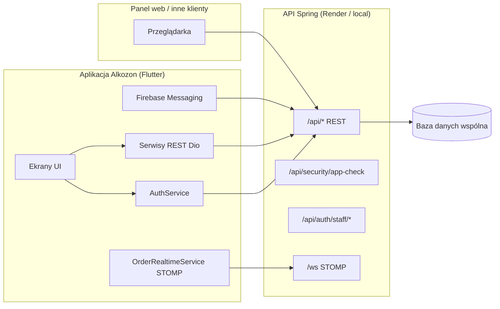

# Dokumentacja aplikacji mobilnej Alkozon

## 1. Metadane i metryka dokumentu

| Pole | Wartość |
|------|---------|
| **Tytuł** | Dokumentacja aplikacji mobilnej Alkozon |
| **Wersja dokumentu** | 1.2 |
| **Data** | 2026-05-20 |
| **Autor** | Zespół mobile Alkozon / dokumentacja wygenerowana w ramach audytu bezpieczeństwa |
| **Status projektu** | Wersja produkcyjna (MVP+): aplikacja obsługuje logowanie pracowników, zamówienia, magazyn, czas pracy, powiadomienia FCM/STOMP. Aktywny rozwój pod kątem bezpieczeństwa i jakości kodu. |

### Changelog

| Data | Wersja | Autor | Opis zmian |
|------|--------|-------|------------|
| 2026-05-20 | 1.0 | — | Pierwsza wersja dokumentacji (architektura, integracje, QA). |
| 2026-05-20 | 1.1 | — | Rozdział 9: pełny opis zabezpieczeń; limit logowania; weryfikacja SHA z terminacją procesu; testy jednostkowe. |
| 2026-05-20 | 1.2 | — | Refaktoryzacja na Clean Architecture (features, domain/data/presentation, DI). |

### Odbiorcy

- Deweloperzy mobilni (Flutter/Dart) — onboarding i utrzymanie kodu.
- QA — scenariusze testów, środowiska `prod` / `local`.
- Backend — integracja JWT, 2FA, `/security/app-check`, REST i WebSocket.
- DevOps / release — podpisy APK, ProGuard, dystrybucja.

---

## 2. Architektura i stos technologiczny

### Podstawowe technologie

| Warstwa | Technologia |
|---------|-------------|
| Framework | **Flutter** / **Dart** (SDK `^3.11.0`) |
| Platforma docelowa | **Android** (`com.alkozon.app`), `minSdk` z Flutter, `compileSdk` 36 |
| HTTP | `dio` |
| Push | `firebase_core`, `firebase_messaging` |
| Realtime | `stomp_dart_client` (WebSocket) |
| Mapy / GPS | `flutter_map`, `geolocator` |
| Skaner | `mobile_scanner` |

Środowisko lokalne: `flutter run --dart-define=APP_ENV=local` + `adb reverse tcp:8080 tcp:8080`.

### Architektura kodu

Wzorzec: **Clean Architecture** — podział na warstwy **domain**, **data**, **presentation** w modułach funkcjonalnych (features), z wstrzykiwaniem zależności przez `InjectionContainer`.

```
lib/
├── app/                      # main(), AlkozonApp, routing
├── core/
│   ├── config/               # ApiConfig
│   ├── di/                   # InjectionContainer (composition root)
│   ├── network/              # DioFactory, AuthTokenProvider
│   ├── security/             # limit logowania, walidacja, SHA, app_termination
│   └── widgets/              # współdzielone widgety UI
└── features/
    ├── auth/                 # domain → data → presentation (login)
    ├── device_security/      # kontrola root/emulator/SHA/ekran
    ├── startup/              # warmup API + app-check
    ├── orders/               # zamówienia
    ├── inventory/            # magazyn
    ├── work_time/            # czas pracy + WorkTimerNotifier
    ├── notifications/        # FCM + historia
    ├── orders_realtime/      # STOMP WebSocket
    ├── dashboard/            # panel główny
    ├── profile/              # profil użytkownika
    └── catalog/              # mapowanie obrazów produktów
```

**Warstwy w każdym feature:**

| Warstwa | Odpowiedzialność | Przykład (auth) |
|---------|------------------|-----------------|
| **domain** | encje, interfejsy repozytoriów, use case’y | `LoginUseCase`, `AuthRepository`, `LoginResult` |
| **data** | źródła danych (API, secure storage), implementacje repozytoriów | `AuthRemoteDataSource`, `AuthRepositoryImpl` |
| **presentation** | UI, kontrolery stanu (`ChangeNotifier`) | `LoginPage`, `DashboardScreen` |

### Zarządzanie stanem

- **Presentation**: `StatefulWidget` + `setState`; kontrolery (`WorkTimerService` / `ChangeNotifier`) w warstwie presentation.
- **Domain**: use case’y wywoływane z UI przez `InjectionContainer.I` (np. `loginUseCase`, `orderRepository`).
- **DI**: `core/di/injection_container.dart` — jedyne miejsce składania zależności (Dio, repozytoria, use case’y).
- **Trwałość**: `flutter_secure_storage` / `shared_preferences` — wyłącznie w warstwie data (data sources).

---

## 3. Integracja i ekosystem

### Diagram przepływu danych



Mobilka i webówka korzystają z tego samego backendu; zmiany zamówień mogą być widoczne w aplikacji przez **STOMP** (`/topic/orders/staff`, `/user/queue/courier-deliveries`) oraz **FCM**.

### Komunikacja z API

| Aspekt | Szczegóły |
|--------|-----------|
| Protokół | **REST** (JSON), **WebSocket** (STOMP) |
| Produkcja | `https://api-alcozon.onrender.com/api`, `wss://api-alcozon.onrender.com/ws` |
| Lokalnie | `http://localhost:8080/api`, `ws://localhost:8080/ws` |
| Dokumentacja API | Swagger/Postman — po stronie repozytorium backendu (brak osadzonego linku w mobile). |

Konfiguracja URL: `lib/services/api_config.dart` (`APP_ENV`, `API_BASE_URL`, `WS_URL` przez `--dart-define`).

### Uwierzytelnianie i autoryzacja

| Element | Implementacja |
|---------|----------------|
| Mechanizm | **JWT** (access + refresh) po logowaniu staff |
| 2FA | E-mail przy pierwszym logowaniu na nowym `deviceId` — `verificationRequired` → `/auth/staff/verify-device` |
| Przechowywanie tokenów | `flutter_secure_storage` — klucze `jwt_access_token`, `jwt_refresh_token` |
| Nagłówek | `Authorization: Bearer <accessToken>` |
| Wygasanie | Refresh token zapisany; odświeżanie automatyczne — do rozbudowy po stronie backendu |

---

## 4. Kluczowe funkcjonalności i logika biznesowa

### Tryb offline / cache

| Obszar | Zachowanie |
|--------|------------|
| Czas pracy | Lokalny stan sesji i przerwy w secure storage; synchronizacja z `/work-logs` po powrocie sieci; przy błędzie sieci stan lokalny pozostaje |
| Zamówienia / magazyn | Dane pobierane z API; brak pełnego offline-first — wymagane połączenie do operacji zapisu |
| Priorytet synchronizacji | **Serwer** jako źródło prawdy dla otwartej sesji pracy; lokalne przerwy zachowane do momentu potwierdzenia backendem |

### Powiadomienia push

| Składnik | Opis |
|----------|------|
| Infrastruktura | **FCM** (`firebase_messaging`) + opcjonalnie banery z **STOMP** |
| Typy | Nowe zamówienia, zmiany statusu, dostawy kurierskie |
| Deep linking | `NotificationService` — `navigatorKey`, kolejka nawigacji po zalogowaniu |

### Funkcje mobilne

- **Aparat / skaner QR** — `mobile_scanner` (magazyn, czas pracy).
- **Geolokalizacja** — `geolocator`, mapa nawigacji do zamówienia (`flutter_map`).
- **Powiadomienia lokalne** — `flutter_local_notifications` (sesja czasu pracy w tle).
- **Biometria** — niezaimplementowana w bieżącej wersji.

---

## 5. Przepływy użytkownika (UI/UX i nawigacja)

### Architektura nawigacji

- `MaterialApp` z nazwanymi trasami: `/login`, `/dashboard`.
- Dashboard: dolna nawigacja / kafelki do modułów (zamówienia, magazyn, czas pracy, profil, powiadomienia).
- `PopScope(canPop: false)` na dashboardzie — blokada przypadkowego wyjścia.

### Deep linki

Obsługa przez payload FCM / STOMP w `NotificationService` — nawigacja do szczegółów zamówienia po autentykacji.

### Design system

Kolory bazowe w kodzie: tło `#F8FAFC`, tekst `#1E293B`, akcenty Material. Logo: `lib/imgs/logo.jpg`. Brak zewnętrznego linku do Figmy w repozytorium — tokeny rozproszone w `ThemeData` i stylach ekranów.

---

## 6. Bezpieczeństwo i przechowywanie danych

### Bezpieczeństwo sieciowe

- Produkcja: wyłącznie **HTTPS** / **WSS** (`ApiConfig.isProduction`, `requiresHttps`).
- Lokalnie: HTTP do `localhost` (tylko dev, z `adb reverse`).
- **SSL pinning**: nie wdrożony — opcjonalna rozszerzenie na przyszłość.

### Dane wrażliwe

- Tokeny i identyfikatory w **EncryptedSharedPreferences** (Android) przez `flutter_secure_storage`.
- **ProGuard/R8** w release: minify + shrink + `proguard-rules.pro`.
- E-mail logowania w `shared_preferences` (niewrażliwy cache UX).

### Zgodność (RODO/GDPR)

- Zgody i polityka prywatności — do uzupełnienia w UI przed publikacją w sklepie; aplikacja zbiera dane operacyjne (lokalizacja w trasie kurierskiej, identyfikator urządzenia) zgodnie z polityką firmy.

---

## 7. Testowanie i jakość kodu

### Strategia testów

| Typ | Zakres |
|-----|--------|
| **Unit** | `test/security/*`, `test/services/auth_service_test.dart`, `test/models/order_realtime_event_test.dart` |
| **Widget / integration** | Brak — do dodania dla krytycznych flow logowania |
| **Analiza statyczna** | `flutter analyze` + `flutter_lints` (`analysis_options.yaml`) |

Uruchomienie testów:

```bash
cd Alkozon
flutter test
flutter analyze
```

### Zasady lintera

Pakiet `flutter_lints`; unikanie `print` w kodzie produkcyjnym (zastąpione `debugPrint` w ścieżkach bezpieczeństwa).

---

## 8. Deployment, CI/CD i infrastruktura

### Środowiska

| Środowisko | Uruchomienie |
|------------|--------------|
| Production | `flutter run` (domyślnie `APP_ENV=prod`) |
| Local | `flutter run --dart-define=APP_ENV=local` |

### Build Android

- Release: podpis przez `android/key.properties` (szablon `key.properties.example`).
- Artefakty: `.apk` / `.aab` — ProGuard włączony w `android/app/build.gradle.kts`.
- SHA certyfikatu: natywny kanał `com.alkozon.app/signing` → `MainActivity.kt`.

### CI/CD i dystrybucja

Brak zdefiniowanego pipeline w repozytorium mobile — rekomendacja: GitHub Actions / Codemagic (build → test → analyze → Firebase App Distribution).

### Monitorowanie

- Firebase (Messaging, opcjonalnie Crashlytics po konfiguracji).
- Logi bezpieczeństwa: `debugPrint` przy terminacji aplikacji.

---

## 9. Zabezpieczenia — implementacja (wymagania projektowe)

Poniżej mapowanie wymagań na kod, pakiety i fragmenty implementacji.

### 9.1 Limit prób logowania

**Pakiet:** `flutter_secure_storage` (licznik i blokada w secure storage).

**Logika:** `lib/security/login_attempt_limiter.dart` — max **5** prób, blokada **15 minut**.

```dart
static const int maxAttempts = 5;
static const Duration lockoutDuration = Duration(minutes: 15);
```

Integracja w `lib/main.dart` — przed wywołaniem `AuthService.login()` sprawdzany jest `checkAllowed()`; po błędzie (bez 2FA) wywoływane jest `recordFailure()`, po sukcesie `recordSuccess()`.

### 9.2 2FA e-mail przy pierwszym logowaniu na nowym urządzeniu

**Backend + mobile:** unikalny `deviceId` w secure storage; endpointy `/auth/staff/login` i `/auth/staff/verify-device`.

```dart
final response = await _dio.post(
  '/auth/staff/login',
  data: {'email': email, 'password': password, 'deviceId': deviceId},
);
if (data['verificationRequired'] == true) {
  return {'requires2fa': true, 'challengeId': data['challengeId'], ...};
}
```

UI: pole „Kod 2FA” na ekranie logowania (`main.dart`).

### 9.3 Secure Storage

**Pakiet:** `flutter_secure_storage: ^9.0.0`

Przechowywane m.in.: `jwt_access_token`, `jwt_refresh_token`, `staff_device_id`, stan limitera logowania, dane sesji czasu pracy.

### 9.4 Obfuskacja ProGuard / R8

**Konfiguracja:** `android/app/build.gradle.kts`

```kotlin
isMinifyEnabled = true
isShrinkResources = true
proguardFiles(
    getDefaultProguardFile("proguard-android-optimize.txt"),
    "proguard-rules.pro"
)
```

Reguły keep: `android/app/proguard-rules.pro` (Flutter, secure storage, Firebase, skaner).

### 9.5 Wykrycie root / emulatora / mock GPS

**Pakiet:** `safe_device: ^1.1.7`

```dart
if (isJailBroken || !isRealDevice || isMockLocation) {
  terminateApp('Security violation (Root/Emulator/GPS)');
}
```

**Tryb deweloperski:** sprawdzany, ale **blokada celowo zakomentowana** (testy USB) — fragment w `security_service.dart` pozostaje bez zmian:

```dart
/*
if (isDevelopmentModeEnable) {
  killApp('Developer mode is active.');
}
*/
```

### 9.6 Podpis APK i weryfikacja SHA (aplikacja się kończy przy złym podpisie)

**Odczyt SHA-256:** kanał natywny Android `MainActivity.kt` → `AppCheckService.readSigningCertSha256()`.

**Weryfikacja lokalna (allowlista):** `lib/security/signing_config.dart` + `SigningCertVerifier` — przy starcie w `SecurityService.checkSecurity()`:

```dart
if (!SigningCertVerifier.isAllowed(
  signingCertSha256,
  SigningConfig.allowedSigningCertSha256,
)) {
  terminateApp('Invalid APK signing certificate (SHA-256).');
}
```

Dodatkowy certyfikat release:

```bash
flutter build apk --dart-define=ALLOWED_SIGNING_SHA256_EXTRA=<sha256_release>
```

**Weryfikacja serwerowa:** `POST /security/app-check` — odpowiedź **403** wywołuje `terminateApp()` (proces kończy się natychmiast):

```dart
if (response.statusCode == 403) {
  terminateApp(
    'Aplikacja nie przeszła weryfikacji bezpieczeństwa (certyfikat APK).',
  );
}
```

Domyślny fingerprint debug (z `FIREBASE_AND_APP_SIGNATURE_HANDOFF.md`):

`e1b17830399a952b8ff905023d5dc98f0a202cbb18941beb06000717341ac7f6`

### 9.7 JWT

Tokeny zapisywane po logowaniu; dekodowanie claims (bez weryfikacji podpisu po stronie klienta — poprawne dla UI):

```dart
Map<String, dynamic>? decodeTokenClaims(String token) {
  final parts = token.split('.');
  if (parts.length != 3) return null;
  // ... base64 decode payload ...
}
```

### 9.8 Blokada nagrywania ekranu i zrzutów

**Pakiet:** `screen_protector: ^1.1.0`

```dart
await ScreenProtector.preventScreenshotOn();
```

Wywołanie w `SecurityService._setupScreenProtection()` przy starcie aplikacji.

### 9.9 Komunikacja HTTPS

Produkcja: `https://api-alcozon.onrender.com/api`. Lokalny dev: HTTP tylko przy `APP_ENV=local`. Flaga `ApiConfig.requiresHttps` dla warunków w przyszłych rozszerzeniach.

### 9.10 Walidacja danych

**Moduł:** `lib/security/input_validators.dart` — e-mail (regex), hasło (min. 8 znaków), kod 2FA (4–8 cyfr). Używane na ekranie logowania przed wysłaniem żądania.

---

## Załączniki

- `FIREBASE_AND_APP_SIGNATURE_HANDOFF.md` — SHA debug, konfiguracja backendu app-check.
- `README.md` — szybki start `prod` / `local`.
